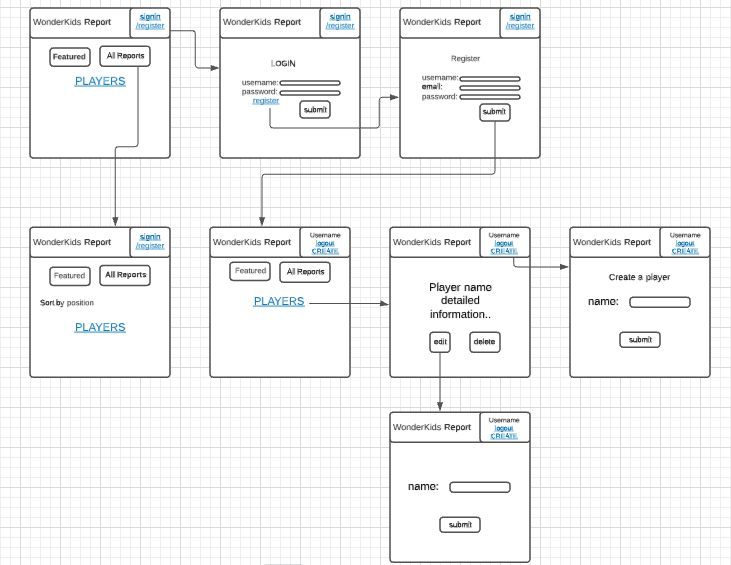
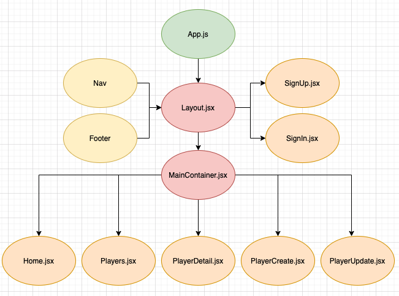
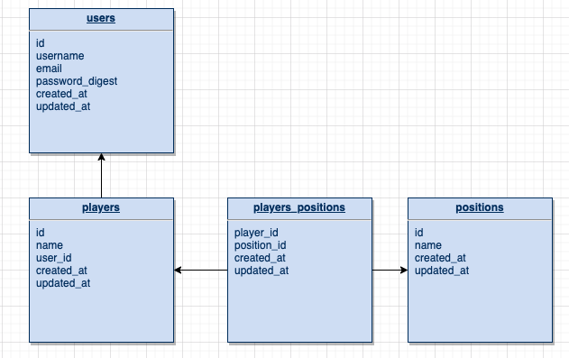

# project_4

## Project Name

WonderKid Report


## Overview

 WonderKid Report is a full-stack website that provides scouting reports regarding top prospects of soccer(or football) industry. It allows users to browse over all the reports on the website. If authorized by registering and signing in, users may create, edit and delete posts, which are associated to their own accounts. This app was built with Ruby on Rails for back-end and React.js for the front-end.
 
### MVP

#### Goals

- Create full CRUD functionality for creating, reading, updating and deleting post.
- Create a non-authorized routes for landing page and player report browsing.
- Create an authorized routes for creating, editing and deleting player reports.
- Build a NoSQL database with PostegreSQL to host all user information.
- Build an user authentication and association to restrict user interaction with app's contents.
- Set media queries for two different devices other than computer screen. 

#### Libraries and Dependencies  

|  Library | Description 

|  React  | Front-end user interaction and state control through manipulation of a virtual DOM.
|  React Router  | Site navigation and routing for single page applications
|   Rails   | Backend model-view-controller framework for Ruby
|   Axios   | Promise-based HTTP client for the browser and node.js

### Client Wireframe


### React Component Tree


### React Component Hierarchy

```
src
|__ App.jsx
|__ index.js
|__ assets/
|__ components/
      |__ Layout/
          |__ Layout.jsx
          |__ Layout.css
      |__ Nav/
          |__ Nav.jsx
          |__ Nav.css
      |__ Footer/
          |__ Footer.jsx
          |__ Footer.css
      |__ Search/
          |__ Search.jsx
          |__ Search.css
      |__ Sort/
          |__ Sort.jsx
          |__ Sort.css
|__ screens/
      |__ Home/
          |__ Home.jsx
          |__ Home.css
      |__ Players/
          |__ Players.jsx
          |__ Players.css
      |__ PlayerDetail/
          |__ PlayerDetail.jsx
          |__ PlayerDetail.css
      |__ PlayerEdit/
          |__ PlayerEdit.jsx
          |__ PlayerEdit.css
      |__ PlayerCreate/
          |__ PlayerCreate.jsx
          |__ PlayerCreate.css
      |__ SignIn/
          |__ SignIn.jsx
          |__ SignIn.css
      |__ Register/
          |__ Register.jsx
          |__ Register.css
|__ services/
      |__ apiConfig.js
      |__ users.js
      |__ players.js
      |__ positions.js
```


## Time Estimates

| Component | Priority | Estimated Time | Time Invested | Actual Time |
| --- | :---: |  :---: | :---: | :---: |
| CORE BACKEND STRUCTURE | H | 3hrs|  |  |
| BACKEND CRUD | H | 2hrs|  |  |
| BACKEND AUTH | H | 2hrs|  |  |
| SEED DATA | H | 2hrs|  |  |
| FRONTEND COMPONENTS HIERARCHY | H | 2hrs| | |
| FRONTEND CRUD | H | 3hrs|  |  |
| FRONTEND AUTH | H | 3hrs|  |  |
| FRONTEND ROUTING | H | 2hrs|  |  |
| FRONTEND STATE MANAGEMENT | H | 2hrs|  |  |
| LANDING PAGE LAYOUT | H | 1hrs|  |  |
| DETAIL PAGE LAYOUT | H | 1hrs|  |  |
| EDIT PAGE LAYOUT | H | 1hrs|  |  |
| CREATE PAGE LAYOUT | H | 1hrs|  |  |
| SIGN IN / REGISTER LAYOUT | H | 1hrs|  |  |
| BASIC CSS | H | 3hrs|  |  |
| DETAILED CSS | H | 3hrs|  |  |
| MEDIA QUERIES SETTING | H | 3hrs|  |  |
| DEBUGGING | H | 3hrs|  |  |
| REVIEW | H | 2hrs|  |  |
| Total | H | 40hrs|  |  |

## Server (Back-End)

### ERD Model


## Post MVP

- Functionality for restricting each user to only be able to update or delete their own posts only.
- Functionality for restricting non-user to be able to read only first few lines of reports.
- Some experimental challenges on CSS for player report cards.
- Create a rank table that lists the most potential players based on ratings.
- Make a like button that may indicate the popularity of each player. 

## Code Showcase
 

## Code Issues & Resolutions

